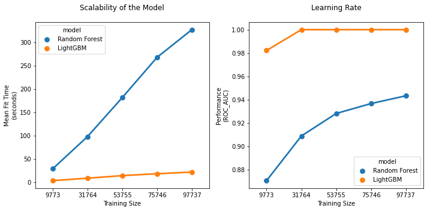

# Student Knowledge Tracing with an Answer Prediction System

*The number of students in the world has been steadily increasing. The UNESCO Institue for Statistics data show the the number of students in the world has been increasing while the ratio of teachers to students has been decreasing. Yet, even with these opposing shifts, the most common way to track student knowledge has been to pose question to a student and have a teacher evaulate the student's response. In this project, I will create knowledge tracing system that will help teachers understand what content a student already knows, and predict the student's learning to new content.*

## 1. Data

Riiid! is one the world’s largest English language schools that helps student learn the content needed to pass an English profiency test for future employment in South Korea. With over 100 million entries detailing students responses to questions and viewing of lectures, this previously proprietary data set, which was opened to global AI researchers as part of the Riiid! AI-ED Challenge 2020, is a sufficient size to develop a good predictor model. 

> * [Riiid! AI-ED Challenge 2020 website](https://www.ednetchallenge.ai/)

> * [Dataset, hosted on Kaggle](https://www.kaggle.com/c/riiid-test-answer-prediction)

## 2. Method

There are several possible approaches to building a knowedge tracing and response prediction system:

1. **Content-based Method:** Predict a student response to new content based on the similarity of the new content to other content with which the student has previously interacted. As this method compare the similarity of features of the new content and the previously encountered content, this method requires high-qualility content metadata and content that is inter-related in some known way in order to make accurate predictions.

2. **Collaborative-based Method:** Predict a student response to content based on how a similar student has previously interacted with the same content. Collaborative tracing relies on information from similar users, so it is important to have a large dataset of students' direct interactions sith the content. It doesn't work well for new schools without any data on the students, or any type of student that is to dissimilar from all other students.

3. **Hybrid Method:** Leverages both content-based & collaborative-based tracing. Typically, when a new student comes into the system, the content-based recommendation takes place. Then after interacting with the items a couple of times, the collaborative/ user based recommendation system will be utilized.

**Selection:Content-based method** 

I chose to work with a content-based tracing and prediction system. This made the most sense because the content has high-quality metadata--all of the content (lectures and questions) are meticulously labelled and tagged. Every content type has a tag, or up to five tags, and labels that shows how content are bundled together and presented to the student. It would be interesting to see what meaning a model can indentify between the content features. In contrast, user data is limited in this dataset. While, Riiid! likely has access to rich, granular user data (such as education level, age, gender, device type, location, etc, social netwrok connections, local time, etc..) from operating a large online school, for the AI-ED Challenge, they have only released a signle user feature. This is probably not enough data to make accurate collaborative-based predictions. In the future, I would love to experiment using a hybrid system to further increase the prredictive abilities of the model.

## 3. Data Cleaning 

As Riiid! and Kaggle have a vested interest in cultivating state-of-the-art models from the competitors with maximium reproducibility, clean data is the baseline expectation. During data import, I found this to be the case. Other than memory size contraints, I was able to easily import from either the csv files or the Kaggle CLI.

## 4. EDA

[EDA Report](https://colab.research.google.com/drive/13dcDkM-_T9a69Mjl5dngUVlCGvbD4wvi)

* Even without feature engineering, some features were predictive of the student's responses.  

In in the left plot, 300 milliseconds in the mean time elapsed while answering the previoius question is a statisically significant seperation between the two predictions. In the right plot, 9 days in the mean user account age is a statisically significant seperation between the two predictions.

## 5. Algorithms & Machine Learning

[Feature Engineering Notebook](https://colab.research.google.com/drive/1NkraGuA-_JZLfqhZdK_H7DKizTBk_4bm)

[ML Notebook](https://colab.research.google.com/drive/11YpddoKfSZ2cPrrB-lrBa1guXZg1c5Q4)

I chose to work with [Sci-kit Learn](https://sklearn.org/) and a Python-implemented [Bayesian Optimization library](https://github.com/fmfn/BayesianOptimization) for selecting and training my model. I tested the feature-engineered dataset on 5 different algorithms that were well-suited for the dataset and the modelling goals. The LightGBM and Random Forest algorithms both scored the best but a comparision of the learning rates shows that LightGBM learns much faster than Random Forest, in terms of both fit time and number of samples.

>***NOTE:** I choose ROC AUC as the scoring metric because the models will be on this metric if entered into the Kaggle competition. The ROC AUC useful when we want to evaluate a model by considering the probabilities it assigns to its predictions, rather than just the predictions only*

**Selection: LightGBM Algorithm**

This algorithm is best descrided by the first paragraph of its documentation:

> LightGBM is a gradient boosting framework that uses tree based learning algorithms. It is designed to be distributed and efficient with the following advantages:
> 
> * Faster training speed and higher efficiency.
> 
> * Lower memory usage.
> 
> * Better accuracy.
> 
> * Capable of handling large-scale data.

While modeling this data, all of those claims were shown to be accurate.

## 8. Future Improvements

* In the future, I would love to integrate an API where a student or teacher, or their app, can query the model with information about some kind of content and receive the prediction without having to use a Jupyter notebook inteface.

* Due to RAM constraints on google colab, I had to train a 1% sample of the original 6x dataset. Without resource limitations, I would love to train on the full dataset. Preliminary tests showed that the bigger the training size, the higher the ROC AUC. 

## 9. Credits

Thanks to the open source devs who maintain Sci-kit Learn, and Shmuel Naaman for being an amazing Springboard mentor.
